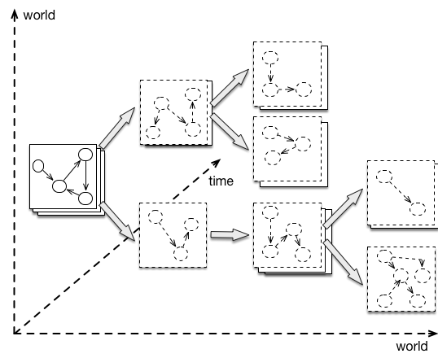

# Many-World graphs
[Code sample here](https://github.com/datathings/greycat-samples/blob/master/src/main/java/greycat/samples/ManyWorld.java)

Prescriptive analytics call for efficient solutions to explore alternative futures, which inevitably diverge when exploring the effects of *what-if* decisions. This is shown in the following figure:




The concept of many-world graphs allows to efficiently fork and update thousands of parallel worlds, even for temporal graphs.

First, we create again a graph, just like for a simple or temporal graph

```java
Graph g = new GraphBuilder().build();
g.connect(isConnected -> {
	    //your next code goes here...
});
```

Then, we specify a time point and a world and create nodes, attributes, and relations for this world at this time.

```java
long timepoint_0 = 0;
long world_0 = 0; //identifies the main world 0;

Node sensor0 = g.newNode(world_0, timepoint_0); //the first param is the world
sensor0.set("id", Type.STRING, "4494F");
sensor0.set("name", Type.STRING, "sensor0");
sensor0.set("value", Type.DOUBLE, 0.5); //set the value of the sensor

```

In this example, node *sensor0* is created in *world_0*. Let's say we want to do a simulation to test what will happen to the system if we have the value of the sensor equal to 4.6.
So first, we fork the current world as following:

```java
long world_1 = g.fork(world_0);
```

Then we ask the node *sensor0* to travel to this world_1 and set its results to 4.6

```java
sensor0.travelInWorld(world_1, new Callback<Node>() {
          @Override
          public void on(Node sensorW1T0) {
               sensorW1T0.set("value", Type.DOUBLE, 4.6);
               //your next code goes here...
          }
      });
```

Finally to test the values, in both world, we can travel at a future date and check the results.

```java
long timepoint_1=10;
sensorW1T0.travel(world_0, timepoint_1, new Callback<Node>() {
  @Override
  public void on(Node sensorW0T1) {
      System.out.println(sensorW0T1); // print {"world":0,"time":10,"id":1,"id":"4494F","name":"sensor0","value":0.5}
      sensorW0T1.travel(world_1, timepoint_1, new Callback<Node>() {
        @Override
        public void on(Node sensorW1T1) {
            System.out.println(sensorW1T1); //print {"world":1,"time":10,"id":1,"id":"4494F","name":"sensor0","value":4.6}
          }
        });
      }
    });
```

At time 10, sensor0 still have the value 0.5 in the original world_0, but it has the value of 4.6 in the world_1. This many-world option allows us to simulate a large number of alternatives when searching for an optimal solution without stopping the data collection.
