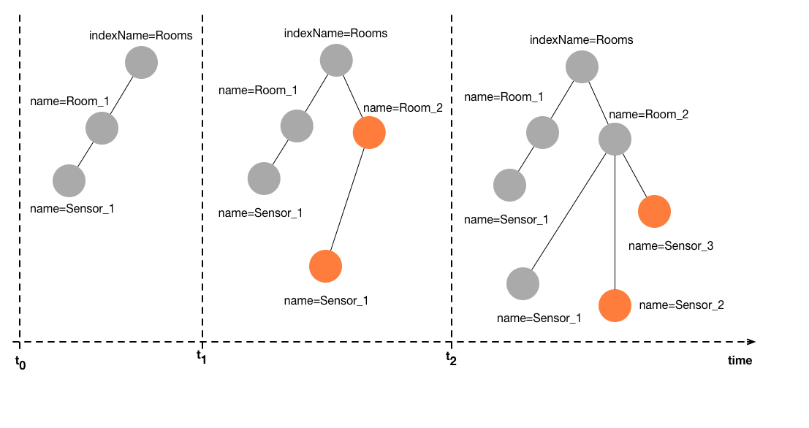

# Temporal graphs
[Code sample here](https://github.com/datathings/greycat-samples/blob/master/src/main/java/greycat/samples/Temporal.java)

Many domains, from social networks to cyber-physical systems to enterprise applications, need to deal with dynamic, i.e., time-evolving data. Think of a time-evolving graph like the following figure:



The orange nodes in the graph represent the changes compared to the version before. Over time, both attributes of the nodes, i.e., values, as well as the structure of the graph itself can change arbitrary. Usually, considering only the latest state of the graph is not enough, instead, many applications require to analyse and correlate past data, or need to navigate through the history to analyse trends. That is where the temporal graphs are required.

First, let's create again a graph, just like for the non-temporal [previous example](minimal.md)

```java
//Create a minimal graph with the default configuration
Graph g = new GraphBuilder().build();
//Connect the graph
g.connect(isConnected -> {
		//Display that the graph database is connected!
		System.out.println("Connected : " + isConnected);
		//your next code goes here...
});
```

Then, we specify a time point and create nodes, attributes, and relations at this time 0.

```java
long timepoint_0 = 0;  //the timestamp is a long and represents the time concept

Node sensor0 = g.newNode(0, timepoint_0); //the second param is the time
sensor0.set("id", Type.STRING, "4494F");
sensor0.set("name", Type.STRING, "sensor0");
sensor0.set("value", Type.DOUBLE, 0.5); //set the value of the sensor
```

Nodes can freely 'travel in time'. This operation will create a temporal view of the node at the requested time.
Each travel in time operation is asynchronous and returns in the callback a new node (here called sensor0T1) which is the new version of the node sensor0 but as resolved for the requested time T1.

```java
long timepoint_1 = 100;
sensor0.travelInTime(timepoint_1, (Node sensor0T1) -> {
		sensor0T1.set("value", Type.DOUBLE, 21.3); //update the value of the time now
		//Display the value at time 0
		System.out.println("T0:" + sensor0.toString()); //print T0:{"world":0,"time":0,"id":1,"id":"4494F","name":"sensor0","value":0.5}
		//Display the value at time now
		System.out.println("T1:" + sensor0T1.toString()); //print T1:{"world":0,"time":100,"id":1,"id":"4494F","name":"sensor0","value":21.3}

		//your next code goes here...
});
```

Here we can see, that the same sensor 0, resolve a value of 0.5 at time 0 and a different value of 21.3 at time T1=100.

The method *travelInTime* can be used to resolve any node at an arbitrary time point. The default behavior of this function is to resolve efficiently the latest known version of the requested node up till the requested time.
Notice that we didn't need to set the attributes ID and names again at time T1. Since we didn't modify them, the resolver keep the last known values as set at tune T0.
As an example, if we go to time T2=50 with (T0<T2<T1), without modifying the values, the resolver will display the information as it was at the last known time before T2 (which is T0)

```java
long timepoint_2= 50;
				 sensor0.travelInTime(timepoint_2, (Node sensor0T2) ->{
						 System.out.println("T2:" + sensor0T2.toString()); //prints T2:{"world":0,"time":50,"id":1,"id":"4494F","name":"sensor0","value":0.5}
				 });
```
